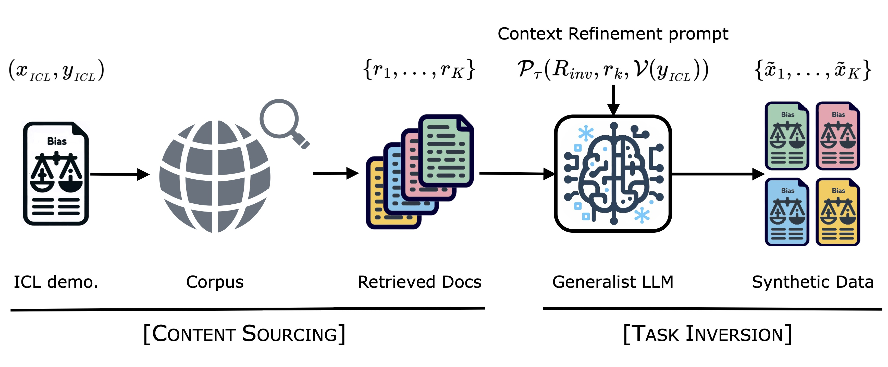

# SynthesizRR: Generating Diverse Datasets with Retrieval Augmentation

This repository contains the implementation of the paper "SynthesizRR: Generating Diverse Datasets with Retrieval Augmentation" (https://arxiv.org/abs/2405.10040)



## Installing dependencies

We recommend installing required dependencies in a new Conda environment using the commands below. 

These commands were tested to work on `Deep Learning AMI GPU PyTorch 1.13.1 (Amazon Linux 2) 20230221` from AWS.

Install dependencies:
```commandline
conda create -n synthesizrr python=3.11.8 --yes  
conda activate synthesizrr 
pip install uv   ## For super-fast installation

uv pip install -r hft3_requirements.txt

uv pip install "spacy==3.7.4" "spacy-transformers==1.3.5"
uv pip install "setuptools==69.5.1"

python -m spacy download en_core_web_lg
python -c "import nltk; nltk.download('punkt');"
```

## Code structure

`synthesizrr/base/` contains utility functions and classes.

`synthesizrr/expts/` contains code to reproduce the experiments.

## Running the code
1. Setup `DATA_DIR`:
   - Download the datasets into a local folder `DATA_DIR`. 
   - Inside `synthesizrr/expt/data.py`, set the variable `DATA_DIR` (marked TODO) to the above folder.
   
2. Setup `CORPUS_DIR`:
   - Download the corpora into a folder `CORPUS_DIR`. 
   - We recommend using S3 for this since the corpora are large.
   - Inside `synthesizrr/expt/corpus.py`, set the variable `CORPUS_DIR` (marked TODO) to the above folder.

3. Setup `RESULTS_DIR`:
   - Inside `synthesizrr/expt/common.py`, set the variable `RESULTS_DIR` (marked with TODO) to a different folder. Intermediate datasets and metrics will be saved here. 
   - We recommend using S3 for this since the file-paths are long.

4. Start a Ray cluster:
   - On the Ray head node, run: `ray start --head`
   - On the Ray worker nodes, run `ray start --address='<head node IP address>:6379'`
   - At the top of the files `data.py`, `corpus.py`, `main.py`, add the following to connect to the Ray cluster:
```commandline
import synthesizrr
import ray
from ray.util.dask import ray_dask_get, enable_dask_on_ray, disable_dask_on_ray
from pprint import pprint
pprint(ray.init(
    address='ray://<head node IP address>:10001',  ## MODIFY THIS
    ignore_reinit_error=True,
    _temp_dir=str('/tmp/ray/'),
    runtime_env={"py_modules": [
        synthesizrr,
    ]},
))
enable_dask_on_ray()
pprint(ray.cluster_resources())  ## Shows you number of cpus and gpus to make sure it is setup properly.
```

5. After modifying the code to set `DATA_DIR`, `CORPUS_DIR` and `RESULTS_DIR`, and starting the Ray cluster, run the following:
   - First, run `cd synthesizrr/expts/ && python3 data.py` to create the datasets. (You will need to download certain datasets to `DATA_DIR` folder beforehand). 
   - Next, run `cd synthesizrr/expts/ && python3 corpus.py` to create the corpora (**warning**, this step needs a lot of compute! Make sure you setup the Ray cluster and use a big machine with at least a few hundred GB of RAM as the head node). 
   - Finally, run the file `cd synthesizrr/expts/ && python3 main.py` to reproduce the experiments.


## Security

See [CONTRIBUTING](CONTRIBUTING.md#security-issue-notifications) for more information.

## License

This project is licensed under the Apache-2.0 License.

## Citing

If you use or refer to this code in another publication, please cite it using the Bibtex below:

```bibtex
@misc{divekar2024synthesizrr,
      title={SynthesizRR: Generating Diverse Datasets with Retrieval Augmentation}, 
      author={Abhishek Divekar and Greg Durrett},
      year={2024},
      eprint={2405.10040},
      archivePrefix={arXiv}
}
```

## Acknowledgements
The compute infrastructure used for these experiments was financially supported by the Amazon Central Machine Learning department.

The following people contributed to the design or implemented smaller components in this codebase: 
- [Gaurav Manchanda](https://in.linkedin.com/in/gauravmanchanda)
- [Siba Rajendran](https://www.linkedin.com/in/siba-rajendran-920135156/)
- [Vijit Malik](https://scholar.google.com/citations?user=noW8sb8AAAAJ&hl=en)
