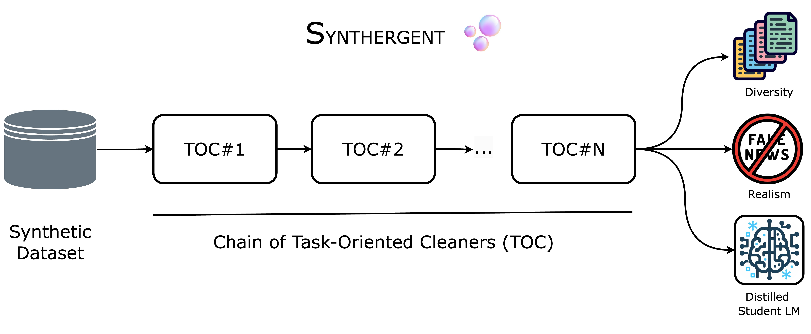

# Synthergent: Scaling the Quality of Synthetic Datasets with Task-Oriented Cleaners

This repository contains the implementation of the paper "Synthergent: Scaling the Quality of Synthetic Datasets with Task-Oriented Cleaners"



## Installing dependencies

We recommend installing required dependencies in a new Conda environment using the commands below.

These commands were tested to work on `Deep Learning AMI GPU PyTorch 1.13.1 (Amazon Linux 2) 20230221` from AWS.

Install dependencies:

```commandline
conda create -n synthergent python=3.11.8 --yes  
conda activate synthergent 
pip install uv   ## For super-fast installation

uv pip install -r requirements.txt

uv pip install "spacy==3.7.4" "spacy-transformers==1.3.5"
uv pip install "setuptools==69.5.1"

python -m spacy download en_core_web_lg
python -c "import nltk; nltk.download('punkt');"
```

## Code structure

`synthergent/base/` contains utility functions and classes.

`synthergent/notebooks/` contains code to reproduce the experiments.

## Start a Ray cluster:

- On the Ray head node, run: `ray start --head`
- On the Ray worker nodes, run `ray start --address='<head node IP address>:6379'`
- At the top of the files `data.py`, `corpus.py`, `main.py`, add the following to connect to the Ray cluster:

```commandline
import synthergent
import ray
from ray.util.dask import ray_dask_get, enable_dask_on_ray, disable_dask_on_ray
from pprint import pprint
pprint(ray.init(
    address='ray://<head node IP address>:10001',  ## MODIFY THIS
    ignore_reinit_error=True,
    _temp_dir=str('/tmp/ray/'),
    runtime_env={"py_modules": [
        synthergent,
    ]},
))
enable_dask_on_ray()
pprint(ray.cluster_resources())  ## Shows you number of cpus and gpus to make sure it is setup properly.
```

## Security

See [CONTRIBUTING](CONTRIBUTING.md#security-issue-notifications) for more information.

## License

This project is licensed under the Apache-2.0 License.

